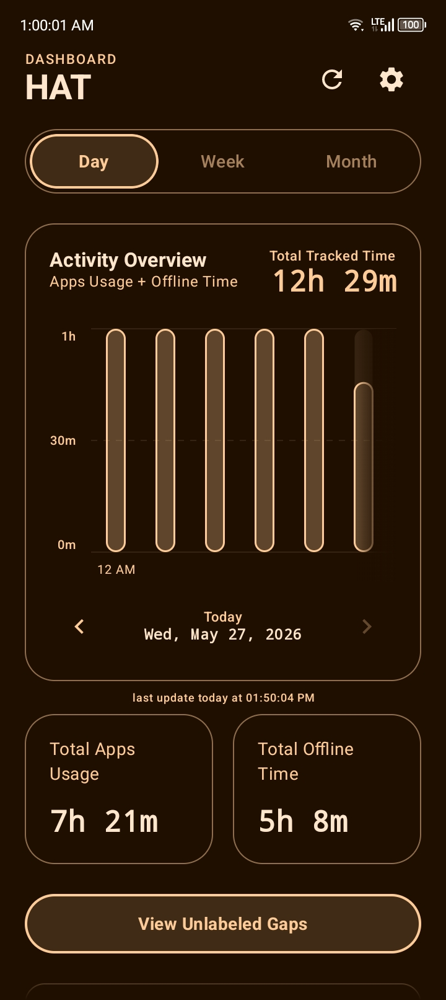
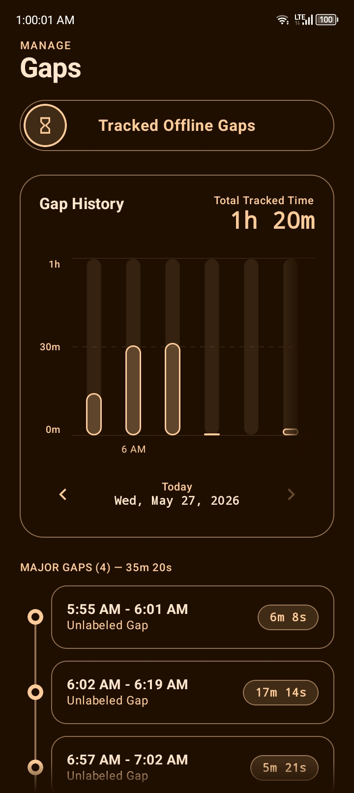
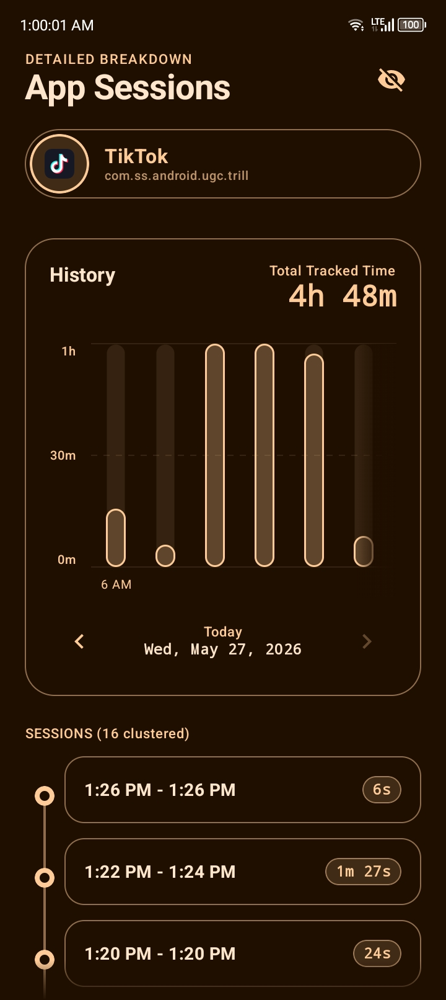
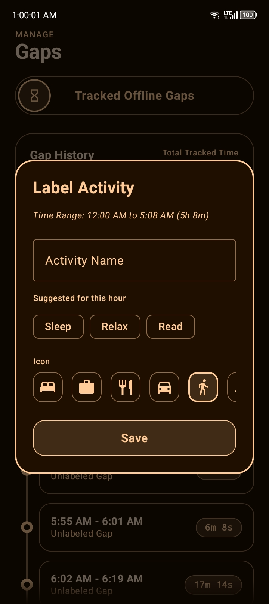
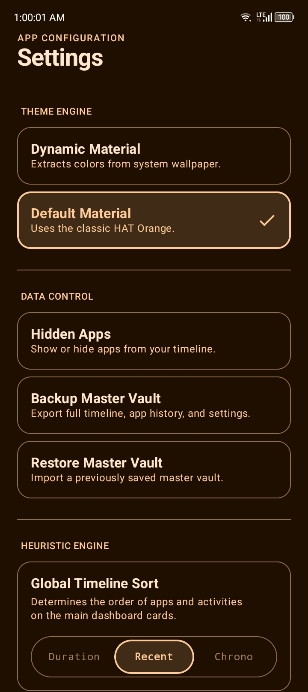

<div align="center">

<br/>


# Heuristic Activity Tracker

*Your entire day, reconstructed. Locally. Privately. Yours.*

<br/>

[](https://www.gnu.org/licenses/agpl-3.0)
[](https://gitlab.com/fdroid/rfp/-/issues/3896)
[](https://github.com/sponsors/andromedvn)
[](https://developer.android.com)
[](https://kotlinlang.org)
[](https://developer.android.com/jetpack/compose)
[](https://andromedvn.github.io/HAT/PRIVACY.html)
[](#privacy--security)
[](#privacy--security)
[](#dynamic-theme-engine)

<br/>

[Privacy Policy](https://andromedvn.github.io/HAT/PRIVACY.html) · [Terms of Service](https://andromedvn.github.io/HAT/TERMS.html) · [Report a Bug](../../issues) · [Request a Feature](../../issues)

</div>

---

## What is HAT?

HAT is an Android app that answers a question most people never think to ask: *where did my day actually go?*

It does this by watching your app usage — something Android already tracks in the background — and inverting it. Every minute you weren't on your phone becomes a labeled block of time called an *offline activity gap*. You label it. That's your day.

There are no accounts. No servers. No cloud sync. HAT has no internet permission at all — it can't send your data anywhere even if it wanted to. Everything lives in a local SQLite database on your device.

This is the full source code.

---

## Table of Contents

- [How It Works](#how-it-works)
- [Features](#features)
- [Screenshots](#screenshots)
- [Architecture](#architecture)
- [The Heuristic Engine](#the-heuristic-engine)
- [Data Model](#data-model)
- [Privacy & Security](#privacy--security)
- [Building from Source](#building-from-source)
- [Tech Stack](#tech-stack)
- [Project Structure](#project-structure)
- [Acknowledgments](#acknowledgments)
- [FAQ](#faq)
- [License](#license)

---

## How It Works

Most screen-time trackers just count how long you used each app. HAT does that too, but it also asks a harder question: what were you doing when you *weren't* on your phone?

Android's `UsageStatsManager` API gives every app access to a log of when apps were opened, paused, resumed, and closed. HAT reads this log to build a complete minute-by-minute timeline for any date in your device's history — not just today.

The flow looks like this:

```
Raw OS Events → UsageStatsEngine → Interval Map → Gap Detection → Timeline
                                        ↓
                              HeuristicEngine processes:
                              • Ghost session detection
                              • Session clustering
                              • Interval subtraction
                              • Chart bucketing (hourly/daily)
```

When you label a gap (say, "Sleeping" from 11 PM to 7 AM), that label gets stored in the local database alongside its timestamp and duration. It shows up in the offline timeline alongside your app activity.

Nothing runs in the background unless you explicitly enable the archive worker. The app queries the OS fresh every time you open it.

---

## Features

### Core Tracking

**App Usage Timeline** — See exactly which apps you used and for how long, down to the session level. Each app entry can be drilled into to view individual session clusters: when you opened it, how many times, and the duration of each session.

**Offline Gap Labeling** — When you weren't on your phone, HAT shows you that gap and lets you label it. You can name it anything, pick an icon, and the entry is permanently stored in your timeline.

**Day / Week / Month Views** — Switch between granularities without losing your place. The interactive chart at the top of each screen adjusts to show hourly buckets (day view) or daily buckets (week/month view).

**Batch Gap Operations** — Long-press multiple gaps to select them, then label the entire batch at once. Useful for recurring activities like "Commute" that appear across dozens of short blocks throughout your timeline.

### Ghost Session Detection

Sometimes your screen stays on for hours in a single app — your phone was playing music, running a background process, or simply left idle with a map open. HAT detects these "ghost sessions" by analyzing the correlation between screen-interactive events and actual app activity.

When a ghost session is detected, HAT surfaces it and asks you what happened:

- **Dismiss** — Mark it as legitimate app usage and remove it from the gap list
- **Label** — Convert it into an offline activity (e.g., the screen was on in Spotify while you were `Running`)

Dismissed ghost sessions are stored and can be restored later from the Dismissed Sessions panel.

### History Archiving

Android only retains usage event data for a limited window (typically a few weeks, varying by device and OS version). HAT includes a background `ArchiveSyncWorker` that silently wakes up on a configurable schedule and copies that data to local storage before the OS discards it.

The archive sync:
- Runs only when battery is not low
- Processes up to 5 days per execution to stay lightweight
- Merges with live OS data so the timeline is always continuous

### Master Vault (Backup & Restore)

Your entire local database — app usage history, offline logs, hidden apps, dismissed sessions — can be exported as a single encrypted `.zip` file called the **Master Vault**.

The vault file is protected with an HMAC-SHA256 signature using a known key. On restore, the signature is verified before any data is touched. If the file has been tampered with or is corrupted, the import fails safely.

The merge logic is intelligent: importing a vault doesn't erase existing data. It merges, skipping any entries that would create a temporal overlap with what's already on device. You can safely import a vault backed up on one phone into another phone, and the timelines will merge seamlessly.

### Dynamic Theme Engine

HAT supports two theme modes:

- **Dynamic Material (Material You)** — On Android 12+, the theme derives its colors from your wallpaper using Android's system dynamic color API. The entire app — backgrounds, borders, icons, shadows — shifts to match.
- **Static Default** — A classic orange palette used for HAT (`#FFB878`) if you prefer a consistent look or are on Android 11 or earlier.

On devices below Android 12, the dynamic mode falls back to a monochromatic palette generated from the wallpaper's dominant color via a custom HSL extraction routine.

### Heuristic Engine Configuration

The Settings screen exposes several tunable parameters that control how the heuristic engine processes your data:

| Setting | What it does |
|---|---|
| **Global Timeline Sort** | Order items by total duration, most recent activity, or chronological first-use |
| **Background History Sync** | How often the archive worker runs (Off / 2h / 6h / custom) |
| **Actionable Gap Minimum** | Minimum gap duration to show in the labeling list (filters out bathroom breaks, quick transitions) |
| **Session Merge Tolerance** | If you switch apps and come back within N minutes, HAT merges those into one session |

### Developer Diagnostics (Easter Egg)

Power users can unlock a hidden Developer Mode directly from the UI:
**Tap the "HAT Dashboard" header text 5 times.** 

This unlocks the hidden `DiagnosticsScreen`, allowing you to bypass the OS history retention limit flag, export raw calculated JSON event matrices, dump local crash logs, and manually clear all tracked data.

### Hidden Apps

Any app can be hidden from the dashboard. Hidden apps are excluded from usage calculations entirely — they won't appear in the timeline, won't count toward total screen time, and won't generate gaps.

This is useful for system apps, launchers, and anything else that shows up in usage stats but isn't meaningful to your day.

### Crash Recovery

HAT has a custom crash handler. If the app encounters an unhandled exception, it writes a detailed crash log — including device information, a breadcrumb trail of the last 50 logged events, and the full stack trace — to a local file.

From the recovery screen you can export crash logs and diagnostic events, initiate a catastrophic "Factory Reset Engine" data nuke, or simply safely restart the app.

---

## Screenshots

> Screenshots available in [`fastlane/metadata/android/en-US/images/phoneScreenshots/`](fastlane/metadata/android/en-US/images/phoneScreenshots/)

<div style="overflow-x: auto; display: flex; gap: 15px; padding: 20px 0; margin: 0 -20px; padding-left: 20px; padding-right: 20px;">
  
  
  
  
  
</div>

---

## Architecture

HAT uses MVVM with Jetpack Compose. A few of the design decisions are non-obvious enough to be worth documenting here.

### Layer Overview

```
┌─────────────────────────────────────────────────────┐
│                      UI Layer                       │
│  Compose Screens → ViewModels → StateFlows          │
├─────────────────────────────────────────────────────┤
│                   Domain Layer                      │
│  HeuristicEngine — pure computation, no I/O         │
├─────────────────────────────────────────────────────┤
│                   Data Layer                        │
│  ActivityRepository — coordinates all data access   │
│     ├── UsageStatsEngine (OS events, live)          │
│     ├── OfflineStorage (SQLite + DataStore)         │
│     └── VaultSecurity (export/import)               │
├─────────────────────────────────────────────────────┤
│                  Worker Layer                       │
│  ArchiveSyncWorker (WorkManager, periodic)          │
└─────────────────────────────────────────────────────┘
```

### Key Design Decisions

**No background service.** HAT never runs a foreground service or long-lived background process. Querying `UsageStatsManager` at app-open time is fast enough (milliseconds for most date ranges), and the battery savings are substantial.

**Interval-based computation.** Rather than storing pre-computed totals, HAT stores raw time intervals (start ms → end ms) and computes everything — durations, totals, chart data, gap detection — on-the-fly from interval math.

**Layered cache.** `ActivityRepository` maintains an in-memory interval cache keyed on the queried time window. Cache hits skip both the SQLite query and the OS query. The cache is invalidated on any data mutation (labeling a gap, restoring a vault, etc.).

**Coroutine-aware interval math.** All interval set operations — merging, subtracting, slicing into time buckets — yield periodically using `kotlinx.coroutines.yield()`. This prevents UI jank when processing thousands of intervals.

**Semaphore-gated icon loading.** App icons are loaded concurrently but capped at 4 simultaneous loads via a Semaphore, with results cached in an LruCache. Preventing unbounded parallelism matters for both memory and performance.

---

## The Heuristic Engine

`HeuristicEngine` is the core computation layer. It takes raw interval data and produces everything the UI needs: sorted app usage lists, gap lists, chart data, session clusters, and ghost detection results.

### Gap Detection

```
Total day window [00:00 → 24:00]
  minus  app usage intervals
  minus  offline activity intervals
  minus  hidden app intervals
  minus  filtered ghost intervals
  ──────────────────────────────
= Unlabeled gaps
```

The subtraction is done with `subtractIntervals()` in `UsageStatsEngine`, which handles partial overlaps correctly — a gap that partially overlaps with an app session gets trimmed, not removed entirely.

### Ghost Session Detection

Ghost detection works by correlating screen-interactive events (`SCREEN_INTERACTIVE`, `KEYGUARD_HIDDEN`) with app activity events (`ACTIVITY_RESUMED`, `ACTIVITY_PAUSED`). An interval of app activity with no concurrent screen-interactive events is a ghost session.

The `ghostTimeTriggerHours` setting (default: 1 hour) controls the minimum duration a ghost interval must reach before HAT surfaces it. Short ghost intervals — like a 45-second screen-on while locked — are filtered out.

### Session Clustering

Raw OS events produce many tiny intervals for apps with frequent pause/resume cycles (especially social media, messaging apps). The `sessionClusteringMins` setting (default: 1 minute) merges adjacent intervals of the same app if the gap between them is smaller than the tolerance.

This cuts the session list noise significantly and produces more meaningful duration numbers.

### Smart Suggestions

When you label a gap, HAT suggests activity names based on your history. The suggestion ranking is distance-weighted: activities you labeled at similar times of day in the past 30 days get higher priority.

If your database is completely fresh, the engine falls back to a time-aware array, automatically suggesting highly probable activities based on the current hour of the day until it gathers enough history.

---

## Data Model

### SQLite Tables

HAT uses a single `hat_heuristic.db` database with Write-Ahead Logging enabled.

**`offline_activities`** — Stores user-created offline log entries.

| Column | Type | Description |
|---|---|---|
| `id` | INTEGER PK | Row identifier |
| `title` | TEXT | Activity name (e.g., "Sleeping") |
| `duration` | INTEGER | Duration in milliseconds |
| `timestamp` | INTEGER | Start time in Unix ms |
| `icon_name` | TEXT | Icon key (e.g., "Sleep", "Walk", "Work") |

**`archived_app_usage`** — Stores historical app usage intervals saved by the archive worker before the OS purges them.

| Column | Type | Description |
|---|---|---|
| `id` | INTEGER PK AUTOINCREMENT | |
| `package_name` | TEXT | App package identifier |
| `start_millis` | INTEGER | Session start in Unix ms |
| `end_millis` | INTEGER | Session end in Unix ms |

A unique index on `(package_name, start_millis, end_millis)` prevents duplicate archive entries.

**`ignored_sessions`** — Records dismissed ghost sessions so they don't resurface.

**`ack_ghosts`** — Records acknowledged ghost sessions (same schema as `ignored_sessions`, different semantic: these were actively confirmed as intentional app usage).

### DataStore (Preferences)

Settings and hidden app lists are stored in Jetpack DataStore as JSON-serialized Kotlin data classes:

- `UserSettings` — All tunable engine parameters and theme preferences
- `Set<String>` of hidden package names

### Vault Format

The exported `.zip` contains three entries:
- `preferences.json` — Serialized `CombinedPreferences` (settings + hidden apps + ignored sessions + acknowledged ghosts)
- `database.db` — Raw SQLite file
- `signature.txt` — Base64-encoded HMAC-SHA256 of the concatenated bytes of the above two files

---

## Privacy & Security

HAT's privacy posture is structural, not policy-based.

**No internet permission.** `AndroidManifest.xml` does not declare `INTERNET` or `ACCESS_NETWORK_STATE`. The OS enforces this — the app cannot make network requests regardless of what any code in the app tries to do.

**No analytics, no crash reporting service.** Crashes are logged to a local file. Diagnostic events are written to a local file. Nothing is transmitted.

**Usage Access is the only sensitive permission.** `PACKAGE_USAGE_STATS` is required to read app activity from `UsageStatsManager`. This is the entire permission surface. HAT does not request contacts, location, calendar, camera, or any other data.

**All data is local.** The SQLite database lives in the app's private internal storage (`context.getDatabasePath()`). The DataStore preferences live in `context.dataStore`. Neither is accessible to other apps.

**Vault integrity checking.** Exported vaults are HMAC-signed. A modified or corrupted vault file will fail verification on import with an explicit error, rather than silently importing bad data.

**History limit transparency.** When querying historical data that predates Android's retention window, HAT explicitly tells you that the data is unavailable rather than silently showing zeros or fabricating data.

---

## Building from Source

### Requirements

HAT was built entirely on-device using **[ACS (Android Code Studio)](https://github.com/AndroidCSOfficial/android-code-studio)**. However, it compiles perfectly using standard desktop environment tools:

- Android Studio Hedgehog (2023.1.1) or later
- JDK 17
- Android SDK with API level 34 build tools
- A device or emulator running Android 8.0 (API 26) or higher

### Steps

```bash
# Clone the repository
git clone https://github.com/andromedvn/HAT.git
cd HAT

# Build a release APK
./gradlew assembleRelease
```

For a release build, you'll need to configure signing. See the [Android documentation on signing](https://developer.android.com/studio/publish/app-signing) for details.

### Granting Usage Access

After installing, the app will prompt you to grant Usage Access permission. This can't be granted via `adb` — you have to navigate to **Settings → Digital Wellbeing & parental controls → Usage access** and enable HAT manually.

If you're setting up an emulator or test device via script, you can simulate granting this permission with:

```bash
adb shell appops set andromedvn.heuristic.activity.tracker GET_USAGE_STATS allow
```

---

## Tech Stack

| Component | Library / API |
|---|---|
| UI Framework | Jetpack Compose (BOM) |
| Navigation | Navigation Compose |
| Architecture | MVVM + StateFlow |
| Async | Kotlin Coroutines |
| Local DB | SQLite (via `SQLiteOpenHelper`) |
| Preferences | Jetpack DataStore Preferences |
| Background Jobs | WorkManager |
| Serialization | kotlinx.serialization |
| Theme | Material 3 + Dynamic Color |
| Usage Data | Android `UsageStatsManager` API |
| Vault Security | HmacSHA256 (javax.crypto) |
| Crash Handler | Custom (no third-party SDK) |

**No third-party analytics, ad SDKs, or remote config libraries are used.**

---

## Project Structure

```
app/src/main/kotlin/andromedvn/heuristic/activity/tracker/
│
├── MainActivity.kt                  # Entry point, navigation host, splash routing
├── CrashRecoveryActivity.kt         # Post-crash UI and log export
│
├── worker/
│   ├── ArchiveSyncWorker.kt         # CoroutineWorker for background history archiving
│   └── WorkerScheduler.kt           # WorkManager setup and cancellation
│
├── domain/
│   └── HeuristicEngine.kt           # Core computation: gaps, sessions, charts, ghosts
│
├── data/
│   ├── ActivityModels.kt            # Data classes and sealed interfaces for the whole app
│   ├── ActivityRepository.kt        # Coordinates OS, archive, and offline data sources
│   ├── HatDatabaseHelper.kt         # SQLiteOpenHelper, schema, index management
│   └── OfflineStorage.kt            # DataStore + SQLite CRUD, vault merge logic
│
├── viewmodel/
│   ├── DashboardViewModel.kt        # Dashboard state: date nav, gap ops, ghost management
│   └── ActivityDetailsViewModel.kt  # Per-app or per-activity detail state
│
├── ui/
│   ├── screens/
│   │   ├── DashboardScreen.kt       # Main timeline + app + offline activity lists
│   │   ├── ActivityDetailsScreen.kt # Drill-down session view for apps or offline items
│   │   ├── LabelGapsScreen.kt       # Unaccounted gap labeling interface
│   │   ├── SettingsScreen.kt        # Engine config, vault, hidden apps, about
│   │   ├── HatSplashScreen.kt       # Animated splash with custom HAT logo drawing
│   │   ├── HiddenAppsScreen.kt      # Manage hidden package list
│   │   └── DiagnosticsScreen.kt     # Developer Easter Egg UI
│   ├── components/
│   │   ├── Charts.kt                # Interactive scrollable bar chart component
│   │   └── CommonComponents.kt      # Shared UI blocks
│   └── theme/
│       ├── Theme.kt                 # MaterialTheme setup, dynamic color generation
│       ├── Color.kt                 # Static color palette (light + dark)
│       └── Type.kt                  # Typography scale (sans-serif + monospace pairing)
│
└── utils/
    ├── UsageStatsEngine.kt          # Raw OS event parsing, interval math
    ├── HeuristicQuotes.kt           # Context-aware tip text for the chart tooltip
    ├── VaultSecurity.kt             # HMAC-signed zip export/import
    ├── AppIconLoader.kt             # Semaphore-gated icon loading with LruCache
    ├── HatLogger.kt                 # Breadcrumb logger + crash handler + file logging
    ├── WallpaperColorExtractor.kt   # Dominant color extraction for dynamic theming
    ├── TimeUtils.kt                 # Duration formatting (ms → "2h 14m", etc.)
    └── PermissionUtils.kt           # Usage stats permission check
```

---

## Acknowledgments

Special thanks to **[Atharok's Screen Time](https://gitlab.com/Atharok/ScreenTime)** for pioneering the open-source offline gap-tracking concept. Their initial architecture heavily inspired the session clustering and ghost detection algorithms in HAT.

---

## Contributing

HAT is a personal project released as free software under the AGPL-3.0 license. Contributions are welcome.

### Bug Reports

Open an issue with:
- Android version and device model
- Steps to reproduce
- What you expected to happen vs. what actually happened
- A crash log if available (Settings → Diagnostics → Export Crash Logs)

### Pull Requests

Before submitting a PR:
- Check that the new code doesn't add any new internet permissions or third-party SDKs
- Make sure it compiles against API 34 with minSdk 26
- If you're adding a new setting, consider how it interacts with the vault merge logic (settings are serialized via `CombinedPreferences` — adding a new field requires it to be `@Serializable` and have a default value for deserialization compatibility)

---

## FAQ

**Does this drain my battery?**

No. HAT has no background service. It queries `UsageStatsManager` when you open the app, which takes a few hundred milliseconds at most. The optional archive worker runs on a configurable schedule and is designed to be lightweight.

**Why can't I see data from before I installed HAT?**

Android's `UsageStatsManager` only retains event data for a limited period — typically between 2 weeks and a few months, depending on your device and OS version. Data older than that is permanently deleted by the OS. HAT's archive worker lets you preserve data before it expires, but you have to enable it before the OS deletes it.

**Can I use this on a custom ROM or degoogled phone?**

Yes, with a caveat. The `UsageStatsManager` API is part of AOSP, so it works on most custom ROMs. The dynamic color theme (`ThemeType.DYNAMIC`) requires Android 12's dynamic color system, which may not be present on all custom ROMs. The app will fall back to the static theme if the system doesn't provide dynamic colors.

**Why SQLite instead of Room?**

SQLite directly via `SQLiteOpenHelper` gives explicit control over transaction batching, which matters for the vault merge operation (merging thousands of archived intervals in a single transaction is significantly faster than individual inserts).

**Can I export my data to CSV or JSON?**

Yes. HAT contains a hidden Developer Diagnostics screen. By tapping the "HAT Dashboard" header on the main screen 5 times, you can unlock Developer Mode and export a "Total Unbounded Matrix" — a JSON file containing all computed data for your selected date range.

**Is this available on F-Droid?**

Not yet. The AGPL-3.0 license and zero-dependency approach make it a natural fit. [Submission is currently pending](https://gitlab.com/fdroid/rfp/-/issues/3896).

**Who built this?**

[andromedvn](https://github.com/andromedvn) — built entirely on-device using [ACS (Android Code Studio)](https://github.com/AndroidCSOfficial/android-code-studio).

---

## License

```
HAT - Heuristic Activity Tracker
Copyright (C) 2026 andromedvn

This program is free software: you can redistribute it and/or modify
it under the terms of the GNU Affero General Public License as published by
the Free Software Foundation, either version 3 of the License, or
(at your option) any later version.

This program is distributed in the hope that it will be useful,
but WITHOUT ANY WARRANTY; without even the implied warranty of
MERCHANTABILITY or FITNESS FOR A PARTICULAR PURPOSE. See the
GNU Affero General Public License for more details.

You should have received a copy of the GNU Affero General Public License
along with this program. If not, see <https://www.gnu.org/licenses/>.
```

See [LICENSE](LICENSE) for the full text.

---

<div align="center">

*Built on-device. No cloud. No ads. No tracking. Just your time.*

</div>
